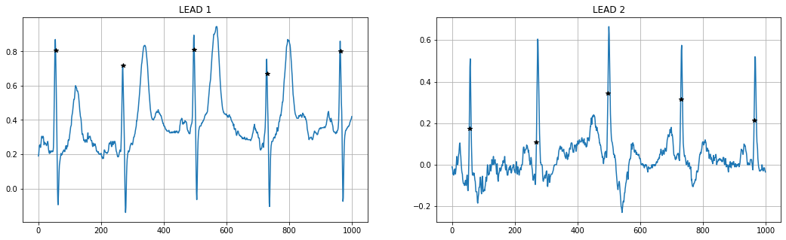
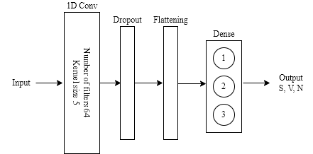
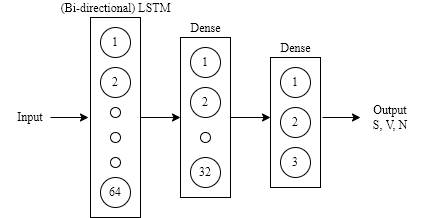

# ECG-Arrhythmia-classification

This is the repo for the project **Applied AI in BIO** course at Polytechnic University of Milan, 2021/2022.

A heart arrhythmia is an irregular heartbeat that occurs when
the electrical signals that coordinate the heart’s beats don’t
work properly.The scope of this assignment was to classify individual heartbeats
in a sample ECG signal. We experimented with two possible
approaches - a classic machine learning model with handcrafted features extracted from the provided samples, and an
image-based CNN approach with generated images from the original ECG signal.

---
## Preprocessing
Each signal from the dataset has three files where one contains the 2-lead ECG signal and the other two are representing the R-peak positions and the beat annotations. The first step was to downsample the signal with higher sampling frequency. The second step was to filter the signal keeping only the frequency range between 0.5 and 35 Hz. Since the problem was to label ECG beats, it was decided to split the signals into fixed-size beats, each containing 70 samples i.e. 35 samples before and after the R peak location. 

 

The majority of the beats were labeled as normal beat, i.e. classified with the label 'N'. Therefore, the SMOTE technique was used to prevent this, instead of cutting of the huge amount of normal beats. The SMOTE is an oversampling technique where the synthetic samples are generated for the minority class. It was applied only to the training data, while the test data remained unchanged so that it correctly represents the original data.

---
## Signal based approach  ##

Based on the feature extractions approaches in literature, additional hand-crafted features were added to the data and fed to the classifier. The average HRV, its median and variance, along with average signal amplitude might provide useful information to the model. Later, two more features (logarithm of the current and the next RR distance) were added. All of the aforementioned features were then concatenated with the 70-sample beats.

In the first approach, following models were tested: the SVM, Random Forest, AdaBoost, Convolutional Neural Network using 1D convolutional layers, Recurrent Neural Networks using LSTM and Bi-directional LSTM layers, and finally, the ones that produced the best results, LightGBM models. 
<table><tr>
<td>  </td>
<td>  </td>
</tr></table> 

---
## Image-based approach ##

We transform each heartbeat signal (previously split in the preprocessing) into images, in particular in Gramian Angular Field(GAF), Markov transition field(MTF), Recurrence plot(RP). 

 

We then concatenate the images in a 3 channel image. Finally we perform a classification task with a CNN (different types were tried)   

Every transformation has its own peculiarities and it focuses on different parts of the signal. The idea of using all of them comes from the fact that multi-modal architectures often performs better with respect to using a single modality. They were concatenated in order to have an input as a three-channel image (the standard representation for RGB images). The convolutional neural network was used to extract the features and classify each beat. Different architectures were tried such as VGG, ResNet, Inception like architectures. The best model was a custom Inception base CNN that has 5 million parameters

To see the transformation you can see this [notebook](https://github.com/calde97/ECG-Arrhythmia-classification/blob/master/notebooks/visualize_image_transformations.ipynb)
 To see the performances this is the [notebook](https://github.com/calde97/ECG-Arrhythmia-classification/blob/master/notebooks/cnn-image-approach.ipynb)
 To perform training run training.py or read this [notebook](https://github.com/calde97/ECG-Arrhythmia-classification/blob/master/notebooks/training_cnn_image_notebook.ipynb)

The structure of the code is the following : 
 In **data** you find the code to generate a custom image generator that takes as input the ECG signals and create a 3 channel image with the 3 transformations mentioned before (GAF, MTF, RP).
 In **models** you find different cnn models used for performing the feature extraction and the classification. You can easily add a new model in the class and use it for training.
 In **training.py** you find the script to run the training. You have to specify few parameters from command line. If you want to check the meaning you can type --h.

To more details on the model architecture and/or training read the brief [report](https://github.com/calde97/ECG-Arrhythmia-classification/blob/master/Report_Calderon_Krajnovic_Milojkovic.pdf)

---
## Results

All the results are calculated as the macro average on the metrics. 

| Model | Accuracy | Precision | Recall | F1-score
|------------|----------|--|--|--|
|1d CNN|0.92|0.43|0.39|0.39
|AdaBoost|0.70|0.43|0.72|0.44
|SVM|0.58|0.59|0.58|0.58
|2d CNN images|0.97|0.83|0.87|0.85
|LSTM|0.98|0.86|0.95|0.90
|BLSTM|0.98|0.91|0.94|0.93
|Random Forest|0.99|0.93|0.93|0.93
|LightGBM|0.99|0.94|0.94|0.94

 ## Project Members ##
 
 * [Calderon, Juan](https://github.com/calde97)
 * [Krajnovic, Aleksandra](https://github.com/akrajnovic)
 * [Milojkovic, Iva](https://github.com/ivamilojkovic)
