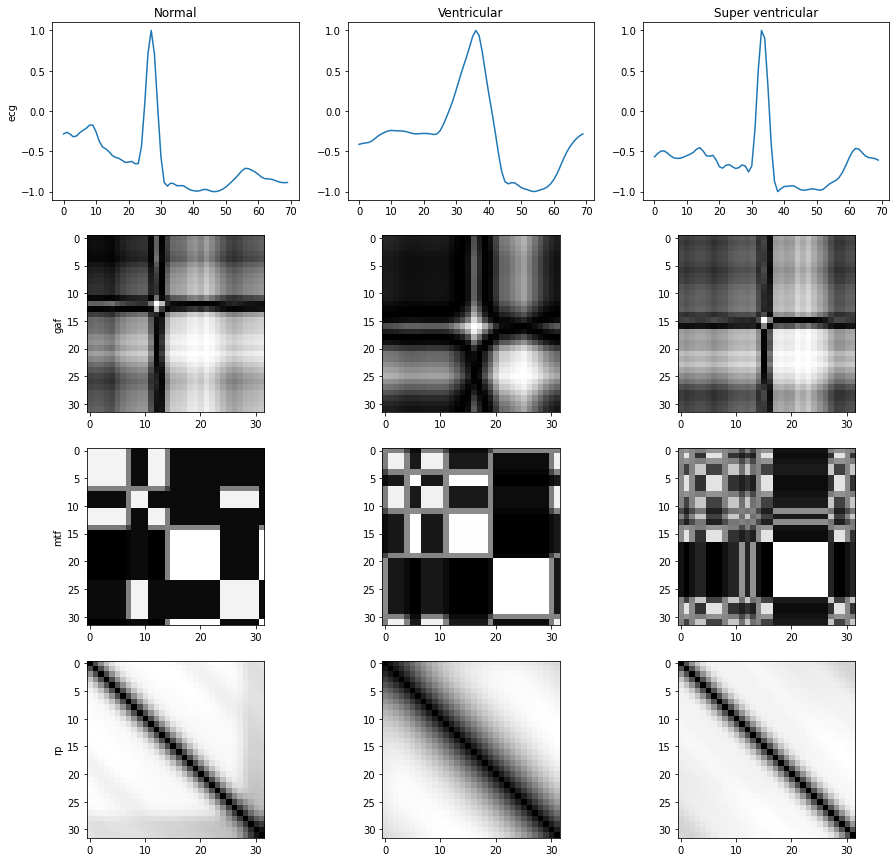

# ECG-Arrhythmia-classification

This is the repo for the project **Applied AI in BIO** course at Polytechnic University of Milan, 2021/2022.

A heart arrhythmia is an irregular heartbeat that occurs when
the electrical signals that coordinate the heart’s beats don’t
work properly.The scope of this assignment was to classify individual heartbeats
in a sample ECG signal. We experimented with two possible
approaches - a classic machine learning model with handcrafted features extracted from the provided samples, and an
image-based CNN approach with generated images from the original ECG signal.

---
## Signal based approach  ##

---
## Image-based approach ##

We transform each heartbeat signal (previously split in the preprocessing) into images, in particular in Gramian Angular Field(GAF), Markov transition field(MTF), Recurrence plot(RP). 

 

We then concatenate the images in a 3 channel image. Finally we perform a classification task with a CNN (different types were tried)   
To see the transformation you can see this [notebook](https://github.com/calde97/ECG-Arrhythmia-classification/blob/master/notebooks/visualize_image_transformations.ipynb)
 To see the performances this is the [notebook](https://github.com/calde97/ECG-Arrhythmia-classification/blob/master/notebooks/cnn-image-approach.ipynb)
 To perform training run training.py or read this [notebook](https://github.com/calde97/ECG-Arrhythmia-classification/blob/master/notebooks/training_cnn_image_notebook.ipynb)

The structure of the code is the following : 
 In **data** you find the code to generate a custom image generator that takes as input the ECG signals and create a 3 channel image with the 3 transformations mentioned before (GAF, MTF, RP).
 In **models** you find different cnn models used for performing the feature extraction and the classification. You can easily add a new model in the class and use it for training.
 In **training.py** you find the script to run the training. You have to specify few parameters from command line. If you want to check the meaning you can type --h.

To more details on the model architecture and/or training read the brief [report](https://github.com/calde97/ECG-Arrhythmia-classification/blob/master/Report_Calderon_Krajnovic_Milojkovic.pdf)

---
## Results

All the results are calculated as the macro average on the metrics. 

| Model | Accuracy | Precision | Recall | F1-score
|------------|----------|--|--|--|
|1d CNN|0.92|0.43|0.39|0.39
|AdaBoost|0.70|0.43|0.72|0.44
|SVM|0.58|0.59|0.58|0.58
|2d CNN images|0.97|0.83|0.87|0.85
|LSTM|0.98|0.86|0.95|0.90
|BLSTM|0.98|0.91|0.94|0.93
|Random Forest|0.99|0.93|0.93|0.93
|LightGBM|0.99|0.94|0.94|0.94

 ## Project Members ##
 
 * [Calderon, Juan](https://github.com/calde97)
 * [Krajnovic, Aleksandra](https://github.com/akrajnovic)
 * [Milojkovic, Iva](https://github.com/ivamilojkovic)
